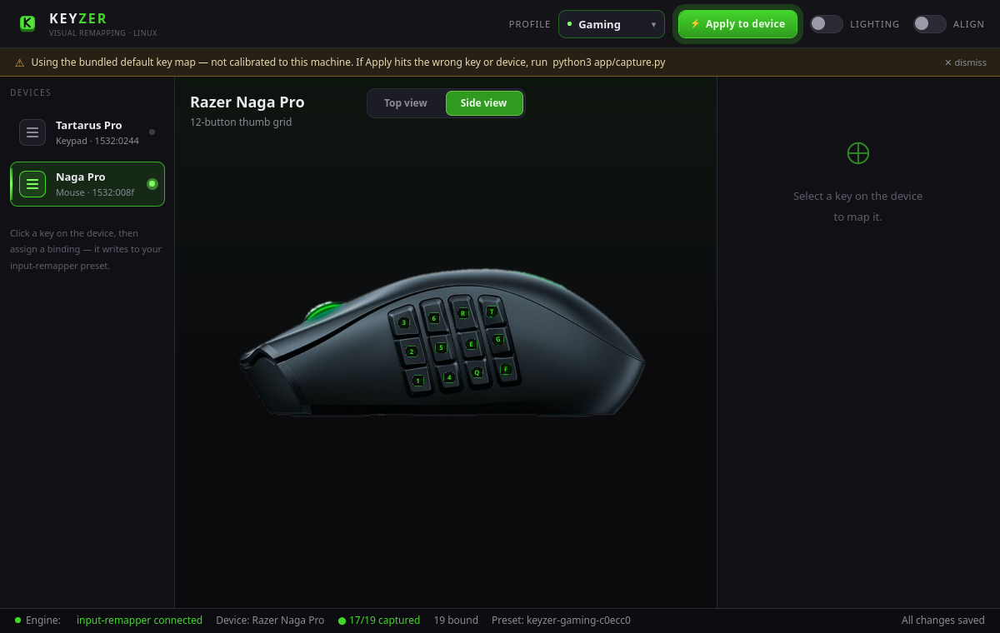
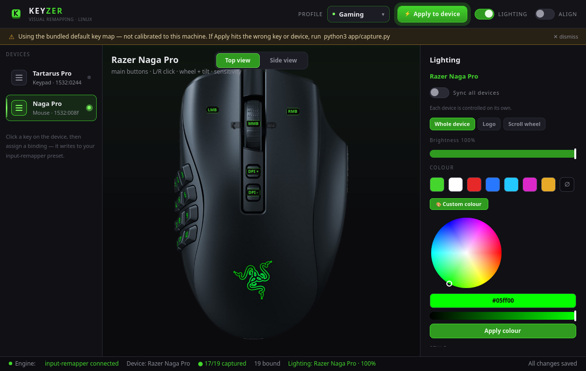

<p align="center">
  
</p>

<p align="center">
  
  
  
  
  
</p>

<p align="center"><b>The Razer Synapse experience Linux never had — click your device, set a key.</b></p>


> Razer Synapse doesn't run on Linux, and [input-remapper](https://github.com/sezanzeb/input-remapper)'s stock editor makes you map raw event codes by hand. **KEYZER gives you the workflow you actually want: see your real device, click a key, pick a binding.** Free, open source, no account, no telemetry.

<table>
  <tr>
    <td width="50%"><br><sub><b>Naga Pro</b> — the 12-button thumb grid, face-on</sub></td>
    <td width="50%"><br><sub><b>Lighting</b> — per-zone Chroma effects + a full colour wheel</sub></td>
  </tr>
</table>

## Supported devices

| Device | USB ID | Views |
|---|---|---|
| Razer Tartarus Pro (keypad) | `1532:0244` | keypad |
| Razer Naga Pro (mouse) | `1532:008f` | top (L/R click · wheel + tilt · sensitivity) · side (12-button thumb grid) |

Adding a device is just an entry in [`layouts.json`](layouts.json) — no code change. PRs welcome for more Razer gear.

## KEYZER vs Razer Synapse

KEYZER isn't trying to out-feature Synapse — it fills the gap Synapse leaves on
Linux, where Synapse simply doesn't run. Here's the honest picture, including where
Synapse is more capable:

| | KEYZER | Razer Synapse |
|---|---|---|
| **Runs on Linux** | ✅ Yes (Wayland + X11) | ❌ Windows / macOS only |
| **Price & account** | ✅ Free, open source, no account | Free, but requires a Razer account |
| **Telemetry** | ✅ None | ❌ Collects usage data |
| **Click-the-device remapping** | ✅ Yes | ✅ Yes |
| **Key / combo / mouse-button bindings** | ✅ Yes | ✅ Yes |
| **Macros** | ⚠️ Basic chords (full macros via input-remapper presets) | ✅ Full recorder with timing |
| **Profiles** | ✅ Yes — plain JSON, import/export, version-control friendly | ✅ Yes — with cloud sync |
| **Per-app / per-game auto-switch** | ❌ Not yet ([roadmap](#roadmap)) | ✅ Yes |
| **RGB / Chroma lighting** | ⚠️ Per-zone colour, brightness & effects (needs OpenRazer) | ✅ Full Chroma Studio (per-key, animations, app sync) |
| **DPI / sensitivity stages** | ❌ No (a hardware function) | ✅ Yes |
| **Hypershift / second layer** | ❌ No | ✅ Yes |
| **On-board memory (profile saved on the device)** | ❌ No — applies live through the OS, so it works system-wide | ✅ Yes — travels with the device |
| **Supported devices** | ⚠️ Tartarus Pro + Naga Pro (more via a JSON entry) | ✅ The full Razer lineup |
| **Support** | Community / unofficial | Official (Razer) |

**The takeaway:** if you're on Windows, use Synapse. If you're on Linux and want
your Razer keypad or mouse to actually be remappable — with a UI instead of raw
event codes — that's what KEYZER is for.

## Install

KEYZER needs two things, both packaged on Ubuntu/Debian: the **input-remapper** engine and **PySide6** (the Qt6 UI). OpenRazer is **optional** (lighting only).

**TL;DR** (Ubuntu/Debian) — clone, run the installer, launch:

```bash
git clone https://github.com/<you>/keyzer.git && cd keyzer && ./install.sh && python3 app/main.py
```

### Ubuntu / Debian (recommended)

```bash
# required: engine + UI
sudo apt install input-remapper \
  python3-pyside6.qtquick python3-pyside6.qtquickcontrols2 \
  python3-pyside6.qtsvg python3-pyside6.qtdbus

# get KEYZER
git clone https://github.com/<you>/keyzer.git
cd keyzer
python3 app/main.py
```

Or just run the helper, which installs what's missing:

```bash
./install.sh
```

### Optional — Chroma lighting (OpenRazer)

Lighting control needs [OpenRazer](https://openrazer.github.io/). Without it, KEYZER works fully for remapping; the Lighting toggle simply stays disabled.

```bash
sudo add-apt-repository ppa:openrazer/stable
sudo apt install openrazer-meta python3-openrazer
# then add yourself to the 'plugdev' group and re-log
```

### Other distros (pip)

```bash
pip install --user PySide6        # if your distro lacks a PySide6 package
# install input-remapper from https://github.com/sezanzeb/input-remapper
python3 app/main.py
```

## Dependencies at a glance

| | Package | Purpose |
|---|---|---|
| **Required** | `input-remapper` (≥ 2.0) | does the actual remapping (evdev → uinput) |
| **Required** | PySide6 (`python3-pyside6.*` or `pip install PySide6`) | the UI |
| Optional | `openrazer-meta`, `python3-openrazer` | per-key Chroma lighting |

KEYZER detects what's present at startup and adapts (the footer shows engine status; the Lighting toggle disables itself without OpenRazer).

## How it works

KEYZER is a friendly front-end; the remapping is done by a proven engine.

```
┌─ KEYZER (this app) ───────────────────────────────────┐
│ device image + clickable hotspots (from layouts.json) │
│ assign panel · profiles · views · lighting            │
│            │ writes preset JSON / drives the daemon    │
└────────────▼──────────────────────────────────────────┘
┌─ input-remapper (engine) ─────────────────────────────┐
│ evdev → uinput remapping, runs as a system service     │
└────────────────────────────────────────────────────────┘
```

KEYZER talks to input-remapper only through its CLI / preset files / DBus — never its internals — so an engine update can't break the UI. See [ARCHITECTURE.md](ARCHITECTURE.md).

## Roadmap

- [x] Visual UI: device images + clickable hotspots, assign panel, profiles, views, theme
- [x] Dependency-aware startup (engine + OpenRazer detection)
- [x] `capture.py` — records the real evdev `(type, code)` each key emits
- [x] Generate input-remapper presets from a profile and reload the daemon (`engine.py`)
- [x] OpenRazer lighting control (per-zone Chroma effects + brightness)
- [ ] App-aware profile switching (GNOME/Wayland active-window)
- [ ] `.deb` package (`Depends: input-remapper, python3-pyside6.*`, `Recommends: openrazer-meta`)

## Disclaimer

KEYZER is an independent, unofficial project — **not affiliated with Razer Inc.**
"Razer", "Tartarus", "Naga", "Chroma" and related marks are trademarks of Razer Inc.,
used here only to identify compatible hardware. See [NOTICE](NOTICE) for details on
trademarks and the bundled device images.

## License

See [LICENSE](LICENSE). (KEYZER's own code; bundled device images are © Razer Inc. — see NOTICE.)
