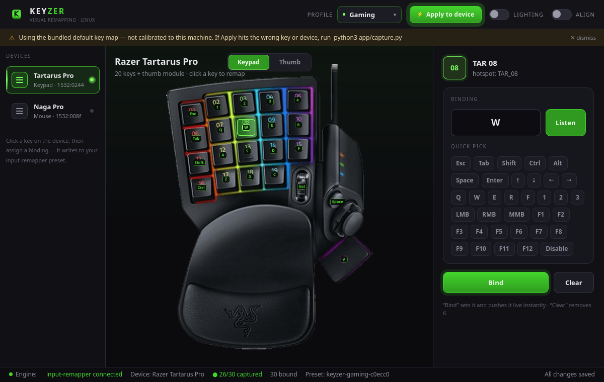

# KEYZER

**A visual key-remapper for Razer peripherals on Linux** — click your device's keys on a picture of the device and bind them, Synapse-style, on top of the open-source [input-remapper](https://github.com/sezanzeb/input-remapper) engine.

Razer Synapse doesn't exist on Linux, and input-remapper's stock editor makes you map raw event codes by hand. KEYZER gives you the workflow you actually want: see your real device, click a key, pick a binding.



## Supported devices

| Device | USB ID | Views |
|---|---|---|
| Razer Tartarus Pro (keypad) | `1532:0244` | keypad |
| Razer Naga Pro (mouse) | `1532:008f` | top (L/R click · wheel + tilt · sensitivity) · side (12-button thumb grid) |

Adding a device is just an entry in [`layouts.json`](layouts.json) — no code change. PRs welcome for more Razer gear.

## Install

KEYZER needs two things, both packaged on Ubuntu/Debian: the **input-remapper** engine and **PySide6** (the Qt6 UI). OpenRazer is **optional** (lighting only).

### Ubuntu / Debian (recommended)

```bash
# required: engine + UI
sudo apt install input-remapper \
  python3-pyside6.qtquick python3-pyside6.qtquickcontrols2 \
  python3-pyside6.qtsvg python3-pyside6.qtdbus

# get KEYZER
git clone https://github.com/<you>/keyzer.git
cd keyzer
python3 app/main.py
```

Or just run the helper, which installs what's missing:

```bash
./install.sh
```

### Optional — Chroma lighting (OpenRazer)

Lighting control needs [OpenRazer](https://openrazer.github.io/). Without it, KEYZER works fully for remapping; the Lighting toggle simply stays disabled.

```bash
sudo add-apt-repository ppa:openrazer/stable
sudo apt install openrazer-meta python3-openrazer
# then add yourself to the 'plugdev' group and re-log
```

### Other distros (pip)

```bash
pip install --user PySide6        # if your distro lacks a PySide6 package
# install input-remapper from https://github.com/sezanzeb/input-remapper
python3 app/main.py
```

## Dependencies at a glance

| | Package | Purpose |
|---|---|---|
| **Required** | `input-remapper` (≥ 2.0) | does the actual remapping (evdev → uinput) |
| **Required** | PySide6 (`python3-pyside6.*` or `pip install PySide6`) | the UI |
| Optional | `openrazer-meta`, `python3-openrazer` | per-key Chroma lighting |

KEYZER detects what's present at startup and adapts (the footer shows engine status; the Lighting toggle disables itself without OpenRazer).

## How it works

KEYZER is a friendly front-end; the remapping is done by a proven engine.

```
┌─ KEYZER (this app) ───────────────────────────────────┐
│ device image + clickable hotspots (from layouts.json) │
│ assign panel · profiles · app-aware · lighting        │
│            │ writes preset JSON / drives the daemon    │
└────────────▼──────────────────────────────────────────┘
┌─ input-remapper (engine) ─────────────────────────────┐
│ evdev → uinput remapping, runs as a system service     │
└────────────────────────────────────────────────────────┘
```

KEYZER talks to input-remapper only through its CLI / preset files / DBus — never its internals — so an engine update can't break the UI. See [ARCHITECTURE.md](ARCHITECTURE.md).

## Roadmap

- [x] Visual UI: device images + clickable hotspots, assign panel, profiles, views, theme
- [x] Dependency-aware startup (engine + OpenRazer detection)
- [x] `capture.py` — records the real evdev `(type, code)` each key emits
- [x] Generate input-remapper presets from a profile and reload the daemon (`engine.py`)
- [x] OpenRazer lighting control (per-zone Chroma effects + brightness)
- [ ] App-aware profile switching (GNOME/Wayland active-window)
- [ ] `.deb` package (`Depends: input-remapper, python3-pyside6.*`, `Recommends: openrazer-meta`)

## Disclaimer

KEYZER is an independent, unofficial project — **not affiliated with Razer Inc.**
"Razer", "Tartarus", "Naga", "Chroma" and related marks are trademarks of Razer Inc.,
used here only to identify compatible hardware. See [NOTICE](NOTICE) for details on
trademarks and the bundled device images.

## License

See [LICENSE](LICENSE). (KEYZER's own code; bundled device images are © Razer Inc. — see NOTICE.)
